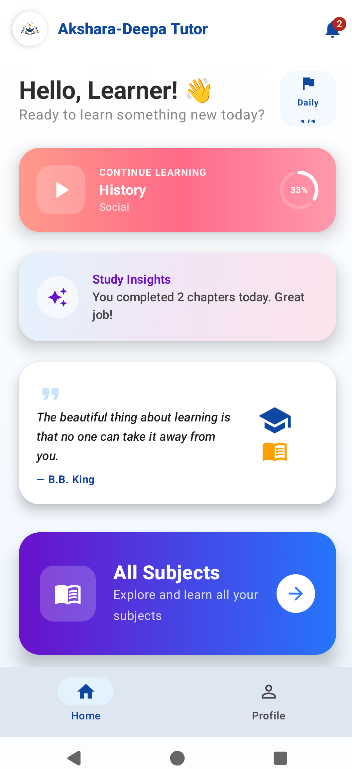
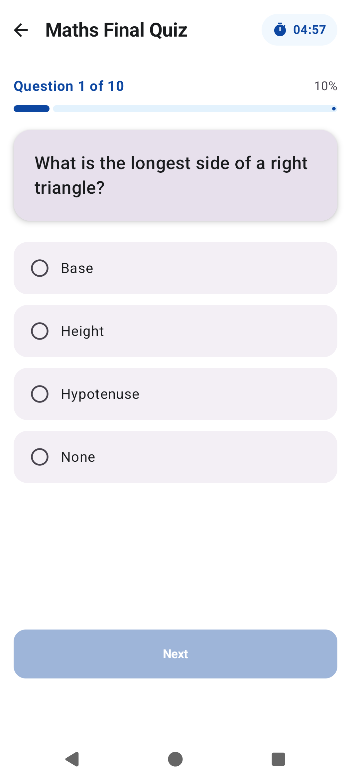
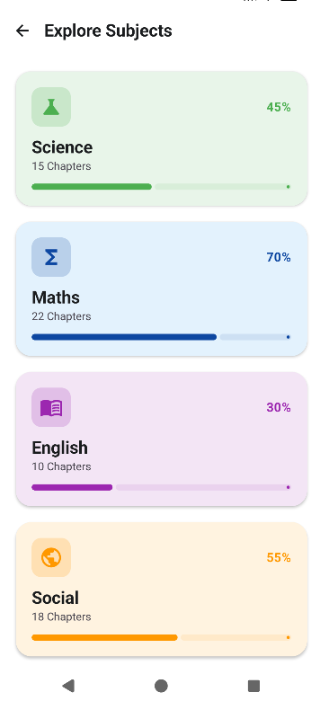

# Akshara-Deepa Tutor 🎓
<p align="center">
  
</p>

**Akshara-Deepa Tutor** is a modern, student-centric Android educational application designed to provide a personalized, offline learning experience. It combines structured study materials with intelligent progress tracking and interactive assessment tools.

---

## 🌟 Key Highlights

- **Advanced Analytics**: Visualizes student performance using custom **Radar Charts** to show subject mastery.
- **Intelligent Tracking**: Automatically detects **Weak Subjects** based on quiz performance (avg < 60%).
- **Interactive Quizzes**: Features a **Timed Quiz Mode** to simulate real exam environments.
- **Gamified Progress**: Earn unique **Achievements** (e.g., "First Steps", "Subject Whiz") as you learn.
- **Responsive UI**: Built with Material 3 and optimized for multiple screen sizes using **WindowSizeClass**.

---

## ✨ Features

- **Personalized Dashboard**: High-level overview of overall progress and last learned sessions.
- **Subject Mastery**: Dedicated sections for Science, Maths, English, and Social Studies.
- **Chapter-wise Learning**: Deep-dive into specific topics with completion tracking.
- **Daily Reminders**: Integration with **WorkManager** to schedule study notifications.
- **Adaptive Dark Mode**: Full support for system-wide dark/light themes.
- **Offline First**: Full functionality without an internet connection using Room persistence.

---

## 🛠 Tech Stack & Tools

- **UI**: [Jetpack Compose](https://developer.android.com/jetpack/compose) (Material 3)
- **Architecture**: MVVM (Model-View-ViewModel) with StateFlow.
- **Database**: [Room](https://developer.android.com/training/data-storage/room) (Entities, DAOs, and TypeConverters).
- **Background Tasks**: [WorkManager](https://developer.android.com/topic/libraries/architecture/workmanager) for local notifications.
- **Local Storage**: [DataStore](https://developer.android.com/topic/libraries/architecture/datastore) for user preferences.
- **Dependency Management**: [Gradle Version Catalog](https://developer.android.com/build/migrate-to-catalogs) (`libs.versions.toml`).
- **Navigation**: Type-safe Compose Navigation.

---

## 📁 Repository Structure

```text
app/src/main/java/com/example/akshara_deepatutor/
├── data/                 # Data Layer: Room DB, Entities, DAOs, Preferences
│   ├── model/            # Domain Models
│   └── repository/       # Data Repositories
├── notifications/        # WorkManager & Notification logic
├── ui/                   # UI Layer
│   ├── components/       # Reusable UI elements (Cards, Chips, Charts)
│   ├── navigation/       # NavGraph and Routes
│   ├── screens/          # Full-screen Composables (Home, Quiz, Dashboard, etc.)
│   ├── theme/            # Theme, Color, and Type definitions
│   └── viewmodels/       # UI State management logic
└── MainActivity.kt       # App Entry Point & Theme Handling
```

---

## 🚀 Installation & Setup

1. **Clone the Repo**:
   ```bash
   git clone https://github.com/H4cknFairy/Akshara-Deepa-Tutor.git
   ```
2. **Open in Android Studio**: Use **Android Studio Ladybug (2024.2.1)** or newer.
3. **Build**: Let Gradle sync and download dependencies.
4. **Run**: Deploy to an emulator or physical device (API 24+).

---

## 📝 Implementation Effort (Originality)

This project goes beyond basic CRUD operations by implementing:
- **Custom Graphics**: A hand-coded `RadarChart` using Compose `Canvas` to visualize performance.
- **Business Logic**: Complex `Flow` transformations in ViewModels to calculate real-time progress across multiple tables.
- **User Experience**: Smooth transitions, timed interactions, and personalized feedback systems.

---

## 📸 Screenshots

| Dashboard (Radar Chart) | Timed Quiz | Subject Progress |
| :---: | :---: | :---: |
|  |  |  |

---
*Developed as part of the Internship Project Submission.*
